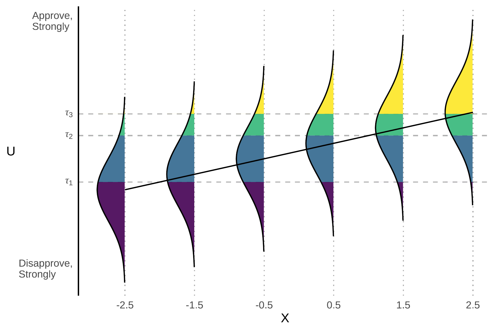
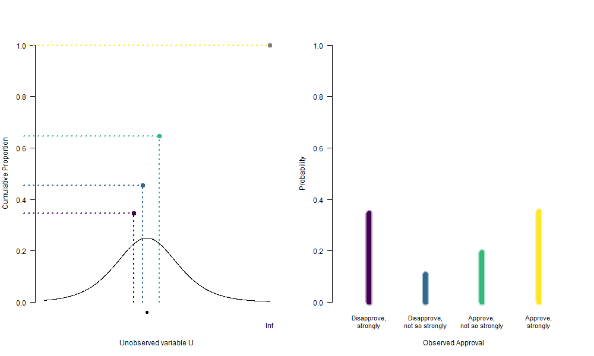

```{r setup, results='hide', message=FALSE}
# The first line sets an option for the final document that can be produced from
# the .Rmd file. Don't worry about it.
knitr::opts_chunk$set(echo = TRUE)

# First you define which packages you need for your analysis and assign it to 
# the p_needed object. 
p_needed <-
  c("viridis", "knitr", "MASS", "pROC")

# Now you check which packages are already installed on your computer.
# The function installed.packages() returns a vector with all the installed 
# packages.
packages <- rownames(installed.packages())
# Then you check which of the packages you need are not installed on your 
# computer yet. Essentially you compare the vector p_needed with the vector
# packages. The result of this comparison is assigned to p_to_install.
p_to_install <- p_needed[!(p_needed %in% packages)]
# If at least one element is in p_to_install you then install those missing
# packages.
if (length(p_to_install) > 0) {
  install.packages(p_to_install)
}
# Now that all packages are installed on the computer, you can load them for
# this project. Additionally the expression returns whether the packages were
# successfully loaded.
sapply(p_needed, require, character.only = TRUE)
```

------------------------------------------------------------------------

# Program for today

In this session, we will learn about:

1.  Ordered Logit Models.

-   Intuition behind the model.
-   Implementation in R.

2.  How to get Quantities of Interest from ordered logit models.

------------------------------------------------------------------------

# Ordered Choice Regression Models

It's time for a new model. We will implement and estimate an ordinal logit model. You will realize that this isn't too different from the logit model. Then, we will discuss how we can obtain quantities of interest such as predicted probabilities.

In surveys respondents are often asked to provide ratings of various kinds. As an example, consider the following questions from the American National Election Study 2012:

> Do you approve or disapprove of the way Barack Obama is handling his job as President?

{width=80%}

and

> Do you (dis)approve strongly or not strongly?

{width=80%}

The result of these two questions are variables that measure approval in four categories that can be **ordered** (from low to high or vice versa).

-   "Disapprove, strongly"
-   "Disapprove, not so strongly"
-   "Approve, not so strongly"
-   "Approve, strongly"

## Intuition behind Ordered Choice Models

Now you will see why the random utility approach for the binary choice models is useful. Remember how in the binary choice case, there are two alternatives, each of which has a utility associated with it.

The decision maker then chooses the alternative that yields the highest utility. We can extend this idea to an ordered choice problem. This means that the decision maker has four different utilities and the respondent would choose a number $0,1,2,3$ that maximizes their utility.

A second way to think about it: The respondent has some level of utility or opinion about the object in question and answers the question on the basis of how great this utility is.

Assume that the respondent has an opinion on how well the President is doing. This opinion is represented by a (unobservable) variable that we label $U$, where higher levels of $U$ mean that the person thinks the President is doing a better job and lower levels mean person thinks the President is doing a worse job.

```{r intuition-1, echo=F, out.width="70%"}
plot(x = 1,
     y = 0,
     type = "n",
     xaxt = "n",
     yaxt = "n",
     bty = "n",
     xlab = "Unobserved variable U\n(Opinion on how well the President is doing)",
     ylab = "",
     xlim = c(0,1))
segments(x0 = 0, x1 = 1,
         y0 = 0, y1 = 0,
         lwd = 2)
axis(1, 
     at = c(0, 1), 
     labels = c("Disapprove,\nstrongly", "Approve,\nstrongly"),
     cex.axis = 0.8, 
     pos = -0.1,
     tick = F)

```

In answering the question, the person is asked to express this opinion in one of four categories: "approve, strongly", "approve, not so strongly", and so on.

That is, even though the person's opinion $U$ can take many different levels representing various levels of liking or disliking the performance of the President, the question only allows four possible responses.

The person chooses a response on the basis of the level of their $U$. If $U$ is below some cutoff, which we label $\tau_1$, the respondent chooses the answer "disapprove strongly." If $U$ is above $\tau_1$ but below another cut-off, $\tau_2$, then person answers "disapprove not strongly". And so on. The decision can then be represented as:

-   "Disapprove strongly" if $U < \tau_1$
-   "Disapprove not strongly" if $\tau_1 \leq U < \tau_2$
-   "Approve not strongly" if $\tau_2 \leq U < \tau_3$
-   "Approve strongly" if $\tau_3 \leq U$.

Or graphically:

```{r intuition-2, echo=F, out.width="70%"}
plot(x = 1,
     y = 0,
     type = "n",
     xaxt = "n",
     yaxt = "n",
     bty = "n",
     xlab = "Unobserved variable U\n(Opinion on how well the President is doing)",
     ylab = "",
     xlim = c(0,1))

taus <- c(0.15, 0.45, 0.85)

segments(x0 = c(0, taus), x1 = c(taus, 1),
         y0 = 0, y1 = 0,
         lwd = 2,
         col = viridis(4))

segments(x0 = taus, x1 = taus,
         y0 = -0.1, y1 = 0.1,
         lwd = 2)

text(x = taus, y = -0.2,
     labels = c(expression(tau[1]),
                expression(tau[2]),
                expression(tau[3])))

text(x = apply(cbind(c(0, taus), c(taus, 1)), 1, mean), 
     y = 0.2,
     labels = c("Disapprove,\nstrongly", "Dissaprove,\nnot so strongly",
                "Approve,\nnot so strongly", "Approve,\nstrongly"),
     col = viridis(4),
     cex = 0.8)


axis(1, 
     at = c(0, 1), 
     labels = c("Disapprove,\nstrongly", "Approve,\nstrongly"),
     cex.axis = 0.8, 
     pos = -0.1,
     tick = F)

```

Now, we, the researchers, observe some factors that contribute to the respondents utility $U$ (or at least we have some theory about how those factors could influence the utility), for example ideology, party affiliation, or income.

Parameterizing this (assuming linearity) gives us the familiar systematic component of the statistical model:

$$
  E(U_i) = X_i\beta
$$

**But:** As with the binary choice model, there are some unobserved factors and we can decompose the utility of the respondent into an observed and an unobserved part. So we get:

$$
  U_i = X_i\beta + \epsilon_i
$$

We need a distributional assumption for error term $\epsilon$. As with models for binary dependent variables, we can choose between two distributions: The *logistic distribution*, $\Lambda(\cdot)$, and the *normal distribution*, $\Phi(\cdot)$. Depending on our choice, we will end up with an *ordered logit model* or a *ordered probit model*.

Which one we choose is a matter of taste. It makes a difference for the math, but the intuition behind the models is the same. Let's start by assuming that $\epsilon$ follows a logistic distribution:

```{r intuition-logistic, echo=F, out.width="70%"}
plot(
  x = 1,
  y = 0,
  type = "n",
  xaxt = "n",
  yaxt = "n",
  bty = "n",
  xlab = "Unobserved variable U\n(Opinion on how well the President is doing)",
  ylab = "",
  xlim = c(0, 1)
)

taus <- c(0.15, 0.45, 0.85)

segments(
  x0 = c(0, taus),
  x1 = c(taus, 1),
  y0 = 0,
  y1 = 0,
  lwd = 2,
  col = viridis(4)
)

segments(
  x0 = taus,
  x1 = taus,
  y0 = -0.1,
  y1 = 0.1,
  lwd = 2
)

text(
  x = taus,
  y = -0.2,
  labels = c(expression(tau[1]),
             expression(tau[2]),
             expression(tau[3]))
)

text(
  x = apply(cbind(c(0, taus), c(taus, 1)), 1, mean),
  y = -0.15,
  labels = c(
    "Disapprove,\nstrongly",
    "Dissaprove,\nnot so strongly",
    "Approve,\nnot so strongly",
    "Approve,\nstrongly"
  ),
  col = viridis(4),
  cex = 0.6
)

x_vals <- seq(0, 1, 0.001)
yscale <- 1 / 3
mu <- 0.35
lines(x = x_vals,
      y = yscale * dlogis(x_vals,
                          location = mu,
                          scale = 0.1))

segments(x0 = mu,
         x1 = mu,
         y0 = 0,
         y1 = -0.4)
text(mu,-0.5, expression(paste(X, beta)))
```

Based on this, let's say we want to learn about Pr(disapprove, strongly). How do we get this?

```{r intuition-disapprove-strongly, echo=F, out.width="70%"}
plot(x = 1,
     y = 0,
     type = "n",
     xaxt = "n",
     yaxt = "n",
     bty = "n",
     xlab = "Unobserved variable U\n(Opinion on how well the President is doing)",
     ylab = "",
     xlim = c(0,1))

taus <- c(0.15, 0.45, 0.85)

segments(x0 = c(0, taus), x1 = c(taus, 1),
         y0 = 0, y1 = 0,
         lwd = 2,
         col = viridis(4))

segments(x0 = taus, x1 = taus,
         y0 = -0.1, y1 = 0.1,
         lwd = 2)

text(x = taus, y = -0.2,
     labels = c(expression(tau[1]),
                expression(tau[2]),
                expression(tau[3])))

text(x = apply(cbind(c(0, taus), c(taus, 1)), 1, mean), 
     y = -0.15,
     labels = c("Disapprove,\nstrongly", "Dissaprove,\nnot so strongly",
                "Approve,\nnot so strongly", "Approve,\nstrongly"),
     col = viridis(4),
     cex = 0.6)

x_vals <- seq(0, 1, 0.001)
yscale <- 1/3
mu <- 0.35
lines(x = x_vals,
      y = yscale*dlogis(x_vals, 
                        location = mu, 
                        scale = 0.1))

segments(x0 = mu, x1 = mu,
         y0 = 0, y1 = -0.4)
text(mu, -0.5, expression(paste(X, beta)))

polseq <- seq(-1, taus[1], 0.001)
polygon(x = c(rev(polseq), polseq),
        y = c(rep(0, length(polseq)), 
              yscale*dlogis(polseq, 
                            location = mu, 
                            scale = 0.1)),
        col = viridis(4, 0.5)[1],
        border = F)
```

Exactly, the probability is given by the integral. The CDF of logistic distribution is given by $\Lambda(x) = \dfrac{e^{x-\mu}}{1+e^{x-\mu}}$. Mathematically, the probability of the answer "disapprove strongly" is thus

$$
\begin{aligned}
  \text{Pr(disapprove strongly)} &= \text{Pr}(U < \tau_1) \\
  &= \text{Pr}(X\beta + \epsilon < \tau_1) \\
  &= \text{Pr}(\epsilon < \tau_1 - X\beta) \\
  &= \frac{e^{\tau_1 - X\beta}}{1 + e^{\tau_1 - X\beta}}.
\end{aligned}
$$

What about the probability of the answer "disapprove not strongly"?

```{r intuition-disapprove-not-strongly, echo=F}
plot(x = 1,
     y = 0,
     type = "n",
     xaxt = "n",
     yaxt = "n",
     bty = "n",
     xlab = "Unobserved variable U\n(Opinion on how well the President is doing)",
     ylab = "",
     xlim = c(0,1))

taus <- c(0.15, 0.45, 0.85)

segments(x0 = c(0, taus), x1 = c(taus, 1),
         y0 = 0, y1 = 0,
         lwd = 2,
         col = viridis(4))

segments(x0 = taus, x1 = taus,
         y0 = -0.1, y1 = 0.1,
         lwd = 2)

text(x = taus, y = -0.2,
     labels = c(expression(tau[1]),
                expression(tau[2]),
                expression(tau[3])))

text(x = apply(cbind(c(0, taus), c(taus, 1)), 1, mean), 
     y = -0.15,
     labels = c("Disapprove,\nstrongly", "Dissaprove,\nnot so strongly",
                "Approve,\nnot so strongly", "Approve,\nstrongly"),
     col = viridis(4),
     cex = 0.6)

x_vals <- seq(0, 1, 0.001)
yscale <- 1/3
mu <- 0.35
lines(x = x_vals,
      y = yscale*dlogis(x_vals, 
                        location = mu, 
                        scale = 0.1))

segments(x0 = mu, x1 = mu,
         y0 = 0, y1 = -0.4)
text(mu, -0.5, expression(paste(X, beta)))

polseq <- seq(taus[1], taus[2], 0.001)
polygon(x = c(rev(polseq), polseq),
        y = c(rep(0, length(polseq)), 
              yscale*dlogis(polseq, 
                            location = mu, 
                            scale = 0.1)),
        col = viridis(4, 0.5)[2],
        border = F)
```

And mathematically:

$$
\begin{aligned}
  \text{Pr(disapprove not strongly)} &= \text{Pr}(\tau_1 \leq U < \tau_2) \\
  &= \text{Pr}(\tau_1 \leq X\beta + \epsilon < \tau_2)  \\
  &= \text{Pr}(\tau_1 - X\beta \leq \epsilon < \tau_2 - X\beta)  \\
  &= \text{Pr}(\epsilon < \tau_2 - X\beta) - \text{Pr}(\epsilon < \tau_1 - X\beta) \\
  &= \frac{e^{\tau_2 - X\beta}}{1 + e^{\tau_2 - X\beta}} - \frac{e^{\tau_1 - X\beta}}{1 + e^{\tau_1 - X\beta}}
\end{aligned}
$$

In general terms, we can express the probability of observation $i$ to give answer $j$ as:

$$
\begin{aligned}
  \text{Pr}(Y_i = j) &= \text{Pr}(\tau_{j-1} \leq U < \tau_j) \\
                     &= F(\tau_j - X_i\beta) - F(\tau_{j-1} - X_i\beta)
\end{aligned}
$$

Where $F(\cdot)$ is the CDF of the error distribution (i.e. the CDF of a logistic or normal distribution, depending on whether we want to have a ordered logit or a ordered probit model).


Once the distribution of errors is specified and we have an independent variable $X$ that would predict $U$, we can compute the probabilities of observing $U$ given $X$. The line represents $E(U_i) = X_i\beta$ on values of $X_i$, and the probabilities of approval rankings correspond to areas of error distribution between the thresholds $\tau_j$.



What we can see is that once $X$ grows, so does the expected utility $E(U)$. The distances between thresholds remain constant, so we can see that as $E(U) = X\beta$
grows, higher values of approval ranking become more likely. So we could get observed values of approval that look like this, given different $X$:

```{r, echo=FALSE, eval=knitr::is_latex_output()}
par(mfrow = c(1,2), las = 1, bty = "n",
     cex.axis = 0.7)

y <- table(c(rep(1, 9), rep(2, 4), rep(3, 3), rep(4, 2)))
plot(
  NULL ,
  xlim = c(0.5, 4.5) ,
  ylim = c(0, max(y)) ,
  xlab = "Approval given small X" ,
  ylab = "Frequency",
  xaxt = "n"
)
axis(1,
     at = 1:4,
     labels = c("Disapprove,\nstrongly",
                "Disapprove,\nnot so strongly",
                "Approve,\nnot so strongly",
                "Approve,\nstrongly"))
for (i in 1:4){
  lines(c(i, i) , c(0, y[i]) , lwd = 5 , col = viridis(4)[i])}

y <- table(c(rep(1, 1), rep(2, 4), rep(3, 5), rep(4, 9)))

plot(
  NULL ,
  xlim = c(0.5, 4.5) ,
  ylim = c(0, max(y)) ,
  xlab = "Approval given large X" ,
  ylab = "Frequency",
  xaxt = "n"
)
axis(1,
     at = 1:4,
     labels = c("Disapprove,\nstrongly",
                "Disapprove,\nnot so strongly",
                "Approve,\nnot so strongly",
                "Approve,\nstrongly"))
for (i in 1:4){
  lines(c(i, i) , c(0, y[i]) , lwd = 5 , col = viridis(4)[i])}


```

```{r, echo=FALSE, eval=knitr::is_html_output()}

```


## The log-likelihood function

In the lecture you derived the log-likelihood:

$$
\begin{aligned}
  \ell(\beta,\tau) &= \sum_{i=1}^n \sum_{j=1}^J y_{ji} \log \left( Pr(Y_{ji} = 1) \right)\\
  &= \sum_{i=1}^n \sum_{j=1}^J y_{ji} \log \left(F(\tau_{j} - X_i\beta) - F(\tau_{j -1} - X_i\beta) \right)
\end{aligned}
$$

where $y_{ji}$ is an indicator taking the value $1$ if observation $i$ falls into response category $j$. Note that we have $k$ parameters in $\beta$ and $J-1$ thresholds.

# Implementation of Ordered Choice Models

Today we will work with the American National Election Study (ANES) from 2012.

```{r, echo=F}
load("raw-data/ANES2012_AQM.RData")

head(df)

par(mfrow = c(2,2))

barplot(table(df$jobapprov),
        border = F,
        main = "Obama Approval Rating",
        names.arg = c("Disapprove,\nstrongly", "", "", "Approve,\nstrongly"),
        cex.names = 0.8,
        cex.main = 0.8,
        las = 1)

barplot(table(df$selfideo),
        main = "Ideology (Self Assesment)",
        names.arg = c("extr.\nliberal", rep("", 5), "extr.\nconserv."),
        cex.names = 0.8,
        border = F,
        cex.main = 0.8,
        las = 1)

barplot(table(df$repid),
        main = "Party Identification",
        names.arg = c("Dem", "Rep"),
        border = F,
        cex.main = 0.8,
        las = 1)

hist(df$polknow,
     main = "Political Knowledge",
     border = F,
     cex.main = 0.8,
     las = 1,
     xlab = "pol. knowledge",
     ylab = "")

```

We are interested in approval ratings of the president. A quick look at the bivariate distribution of ideology and presidential approval reminds us, why a standard linear regression might not be very appropriate:

```{r echo=F}
# this gives us some additional space on the left for the axis annotation
par(mar = c(5, 6, 4, 2) + 0.1)
plot(jitter(df$selfideo),
     jitter(as.numeric(df$jobapprov)),
     pch = 19,
     col = viridis(1, 0.1),
     main = "Ideology and President Approval (Obama)",
     font.main = 1,
     xlab = "Ideology",
     ylab = "",
     xaxt = "n",
     yaxt = "n",
     bty = "n")
axis(1,
     at = 1:7,
     labels = c("extremely\nliberal", rep("", 5),
                "extremely\nconservative"),
     cex.axis = 0.7)
axis(2,
     at = 0:3,
     labels = c("Disapprove,\nstrongly",
                "Disapprove,\nnot so strongly",
                "Approve,\nnot so strongly",
                "Approve,\nstrongly"),
     las = 1,
     cex.axis = 0.7)

```

Two Problems:

-   We would have to assume equal distances between the approval rating answers.
-   No approval rating below 1 and above 4 (similar to binary variables that only take values 0 and 1).

## Translating the log-likelihood to R

So as always, in order to implement the ordered logit model from above, all that we need to do is to translate the log-likelihood into `R`.

Here and there this gets a little tricky, so we do it together as an exercise. What makes the ordered choice problem a bit more tricky is that we need to transform our dependent variable into a matrix of indicators.

Note that in the log-likelihood function $y_{ji}$ is an indicator whether a response falls into a particular category, it is *not* a number $1,2,3$ or $4$.

Let's transform our dependent variable into a matrix of indicators.

Hint: The matrix will have four columns, one `TRUE` in each row and three `FALSE`s.

```{r}
cats <- sort(unique(df$jobapprov))  # Different categories
J <- length(unique(df$jobapprov))  # Number of categories

Z <-
  matrix(NA, nrow = length(df$jobapprov), ncol = J)  # Empty indicator matrix

for (j in 1:J) {
  Z[, j] <- df$jobapprov == cats[j]
}

head(Z)
```

That's new... Now our dependent variable is a matrix.

```{r}
ll_ologit <- function(theta, Z, X) {
  k <- ncol(X)
  J <- ncol(Z)
  
  # Subset theta
  beta <- theta[1:k]
  
  tau <- theta[(k + 1):(k + J - 1)]
  
  # Linear Predictor
  U <- X %*% beta
  
  # Probabilities in a matrix
  probs <- matrix(nrow = length(U), ncol = J)
  
  # Calculate Probabilities for the different tau values
  
  # The first category is different
  probs[, 1] <- 1 / (1 + exp(-(tau[1] - U)))
  
  # Now the categories in between
  for (j in 2:(J - 1)) {
    probs[, j] <- 1 / (1 + exp(-(tau[j] - U))) -
      1 / (1 + exp(-(tau[j - 1] - U)))
  }
  
  # And the last category is different again.
  probs[, J] <- 1 - 1 / (1 + exp(-(tau[J - 1] - U)))
  
  ll <- sum(log(probs[Z]))
  
  # sum over probabilities
  return(ll)
}
```

Let's try our new model!

```{r}
X <-
  cbind(df$selfideo, df$repid, df$demid, df$polknow) # Why no column of 1s?

startvals <-
  c(rep(0, 4),-2,-1, 0) # How many startvalues do we need?

res <- optim(
  startvals,
  ll_ologit,
  Z = Z,
  X = X,
  method = "L-BFGS-B",
  control = list(fnscale = -1, trace = T),
  hessian = TRUE
)

results <- cbind(res$par, sqrt(diag(solve(-res$hessian))))

rownames(results) <- c("selfplacement",
                       "republican",
                       "democrat",
                       "knowledge",
                       "tau1",
                       "tau2",
                       "tau3")

colnames(results) <- c("Coef", "SE")

results
```

Let's check our implementation. We will check our results against `polr()` from the MASS-package which implements ordered logit and probit regression models in `R`.

```{r}
df$jobapprov <- as.factor(df$jobapprov)

m <- polr(jobapprov ~ selfideo + repid + demid + polknow, 
          data = df, 
          Hess = TRUE,
          method = "logistic")

## view a summary of the model
summary(m)
```

Look's great!

## Parallel Regression Assumption

As you have seen, essentially, what we did was estimate $J-1$ logistic curves which only differed in their intercepts, i.e. shift to the left or right, and not in slopes, i.e. the $\beta$'s:

$$
\begin{aligned}
  \text{Pr}(y_i \leq 0) &= \Lambda({\tau_1 - X\beta})\\
  \text{Pr}(y_i \leq 1) &= \Lambda({\tau_2 - X\beta})\\
  \text{Pr}(y_i \leq 2) &= \Lambda({\tau_3 - X\beta})\\
  \text{Pr}(y_i \leq 3) &= 1  \text{ (not estimated)} 
\end{aligned}
$$

This implies that we have identical $\beta$'s across the categories, i.e. the factors that explain the difference between each two categories are the same. In other words, we only estimate one $\beta$ for each independent variable rather than having that coefficient estimate change as we move from one category of the dependent variable to another. This is an assumption of the model and we can actually see if it holds by estimating a set of logit models with $y \leq j$ for $1 < j < J - 1$ and comparing the coefficients for $\beta$:

```{r}
df$jobapprov_1 <- ifelse(as.numeric(df$jobapprov) < 2, 1, 0) # 1
df$jobapprov_2 <- ifelse(as.numeric(df$jobapprov) < 3, 1, 0) # 1 or 2
df$jobapprov_3 <- ifelse(as.numeric(df$jobapprov) < 4, 1, 0) # 1 or 2 or 3

coef(m)
coef(glm(jobapprov_1 ~ selfideo + repid + demid + polknow, data = df, family = "binomial"))
coef(glm(jobapprov_2 ~ selfideo + repid + demid + polknow, data = df, family = "binomial"))
coef(glm(jobapprov_3 ~ selfideo + repid + demid + polknow, data = df, family = "binomial"))
```

**Why do the coefficients differ in sign?**

Compare logit link function:

$$
\text{Pr}(y_i = 1) = \Lambda({X\beta})
$$

and the ordered logit:

$$
\text{Pr}(y_i = 1) = \Lambda({\tau_1 - X\beta})
$$

This difference is closely related to how we coded the dependent variables for separate logit models: the "success" category $y = 1$ there was the values below a certain threshold. In the ordered logit, the positive coefficients would imply variable's contribution to increasing the probability for a higher-ranked category.

## Exercise: What about an ordered probit model?

It's your turn again. Change the code from the ordered logit so that you have an ordered probit model. And check if your function works.

**Hint:** You only need to change the calculation of the log-likelihood. Remember that `1 / (1 + exp(-x)` is the CDF of logistic distribution. For the probit model, you need to use the CDF of the normal distribution instead (which is implemented in `R` already).

```{r, eval=F}
# start by copying the log likelihood function for the ordered logit model.
# name your new function ll_oprobit

ll_oprobit <- ??

# Check whether your function works:

startvals <- c(rep(1, 4),-2,-1, 0)

resOprobit <- optim(
  startvals,
  ll_oprobit,
  Z = Z,
  X = X,
  method = "BFGS",
  control = list(fnscale = -1, trace = T),
  hessian = TRUE
)
resOprobit$par
```

and check the results again:

```{r}
m_probit <- polr(jobapprov ~ selfideo + repid + demid + polknow, 
                 data = df, 
                 Hess = TRUE,
                 method = "probit")

## view a summary of the model
summary(m_probit)
```

```{r}
res$par
```

# Quantities of Interest

**Who can tell me how to interpret these coefficients?**

A better idea is to calculate some meaningful quantities of interest (we will add simulation in the next session). We will use the observed value approach. (Because what would the mean of `demid` or `repid` mean??)

We will carry on with the observed value approach that we have discussed last week:

```{r}
ideology_seq <-
  seq(min(df$selfideo), max(df$selfideo) , length.out = 100)

cases <- array(NA, c(dim(X), length(ideology_seq)))

cases[, ,] <- X

sel <- 1 # The column of X that contains ideology

for (i in 1:length(ideology_seq)) {
  cases[, 1, i] <- ideology_seq[i]
}


# calculate systematic component to get U
U <- matrix(nrow = nrow(X), 
            ncol = length(ideology_seq))

for (i in 1:length(ideology_seq)) {
  U[, i] <- cases[, , i] %*% res$par[1:4]
}


# use U to derive probabilities (link function)
probs <- array(NA, c(dim(Z), length(ideology_seq)))

# get thresholds
tau <- res$par[5:7]

for (i in 1:length(ideology_seq)) {
  # calculate probabilities
  
  # Lowest Category
  probs[, 1, i] <- exp(tau[1] - U[, i]) / (1 + exp(tau[1] - U[, i]))
  
  # Middle Categories
  for (j in 2:(ncol(Z) - 1)) {
    probs[, j, i] <- exp(tau[j] - U[, i]) / (1 + exp(tau[j] - U[, i])) -
      exp(tau[j - 1] - U[, i]) / (1 + exp(tau[j - 1] - U[, i]))
  }
  
  # Highest Category
  probs[, ncol(Z), i] <-
    1 - exp(tau[J - 1] - U[, i]) / (1 + exp(tau[J - 1] - U[, i]))
}

# Now the means of the observed values
ovaP_mean <- matrix(ncol = ncol(Z), nrow = length(ideology_seq))

for (i in 1:length(ideology_seq)) {
  ovaP_mean[i, ] <- apply(probs[, , i], 2, mean)
}

plotdf <- data.frame(ovaP_mean)
names(plotdf) <- paste0("cat", 1:4)
```

Let's plot this:

```{r}

# first line gives us some additional space on the right for a legend
# xpd let's us plot outside the plot region
par(mar = c(5, 4, 4, 8) + 0.1,
    xpd = T)

plot(ideology_seq,
     plotdf$cat1,
     type = "n",
     ylim = c(0,1),
     ylab = "Predicted Probabilities (stacked)",
     xlab = "Ideology",
     main = "Ideology and President Approval (Obama)",
     font.main = 1,
     xaxt = "n",
     las = 1,
     bty = "n")
axis(1,
     at = 1:7,
     labels = c("extremely\nliberal", rep("", 5),
                "extremely\nconservative"),
     cex.axis = 0.7)


polygon(x = c(ideology_seq, rev(ideology_seq)),
        y = c(plotdf$cat1, rep(0, length(ideology_seq))),
        col = viridis(4, 0.5)[1],
        border = F)
polygon(x = c(ideology_seq, rev(ideology_seq)),
        y = c(rowSums(plotdf[,1:2]), rev(plotdf$cat1)),
        col = viridis(4, 0.5)[2],
        border = F)
polygon(x = c(ideology_seq, rev(ideology_seq)),
        y = c(rowSums(plotdf[,1:3]), rev(rowSums(plotdf[,1:2]))),
        col = viridis(4, 0.5)[3],
        border = F)
polygon(x = c(ideology_seq, rev(ideology_seq)),
        y = c(rowSums(plotdf[,1:4]), rev(rowSums(plotdf[,1:3]))),
        col = viridis(4, 0.5)[4],
        border = F)

lines(ideology_seq,
      plotdf$cat1)
lines(ideology_seq,
      rowSums(plotdf[,1:2]))
lines(ideology_seq,
      rowSums(plotdf[,1:3]))
lines(ideology_seq,
      rowSums(plotdf[,1:4]))

text(x = rep(7, 4),
     y = c(0.93, 0.78, 0.63, 0.3),
     labels = c("Approve,\nstrongly",
                "Approve,\nnot so strongly",
                "Disapprove,\nnot so strongly",
                "Disapprove,\nstrongly"),
     cex = 0.5,
     pos = 4)
```

# Appendix: Simulation of Quantities of Interest {.tabset}

This plot does not really have any uncertainty... With ordered logit models, presentation of all predicted probabilities with uncertainties is possible, but the plot may look quite dense:

```{r simulation-setup}
set.seed(20230420)

nsim <- 1000
S <- mvrnorm(nsim, res$par, solve(-res$hessian))

# 7 ideology values (as in data)
ideology_seq <- seq(min(df$selfideo), max(df$selfideo), length.out = 7)
```

## Average Case Approach 

```{r}
aca_scenario <- matrix(rep(apply(X[,-1], 2, mean), 7), 
                       ncol = 3, byrow = T)
aca_scenario <- cbind(ideology_seq, aca_scenario)

## Utility for each scenario
U <- S[,1:4] %*% t(aca_scenario)

## threshold values
tau <- S[, -c(1:4)]
ncat <- ncol(tau) + 1

## empty object for probabilities
probs <- array(NA, c(nsim, ncat, length(ideology_seq)))

## calculate probabilities: work with a column of 1000 simulated taus 
## and column in U for each scenario of ideology 
for (i in 1:length(ideology_seq)) {
  probs[, 1, i] <- exp(tau[, 1] - U[, i]) / (1 + exp(tau[, 1] - U[, i]))
  
  for (j in 2:(ncat - 1)) {
    probs[, j, i] <-
      exp(tau[, j] - U[, i]) / (1 + exp(tau[, j] - U[, i])) -
      exp(tau[, j - 1] - U[, i]) / (1 + exp(tau[, j - 1] - U[, i]))
  }
  probs[, ncat, i] <-
    1 - exp(tau[, J - 1] - U[, i]) / (1 + exp(tau[, J - 1] - U[, i]))
}

## prepare the expected values for plotting
aca_plot <- array(dim = c(ncat, length(ideology_seq), 3))

for (i in 1:length(ideology_seq)) {
  aca_plot[, i, 1] <- apply(probs[, , i], 2, mean)
  aca_plot[, i, 2] <- apply(probs[, , i], 2, quantile, 0.025)
  aca_plot[, i, 3] <- apply(probs[, , i], 2, quantile, 0.975)
}
```


```{r aca-plot, out.width="90%", echo=FALSE}
par(mar = c(5, 5, 4, 2),
    xpd = TRUE,
    las = 1)
plot(
  x = ideology_seq,
  y = aca_plot[1, , 1],
  pch = "",
  ylim = c(0, 1),
  xlim = c(0.7, 7.3),
  xlab = "Ideological Self-placement",
  ylab = "Pr(category)",
  main = "Predicted Probabilities (ACA)",
  cex.axis = 0.8,
  cex.lab = 0.8,
  cex.main = 0.8,
  xaxt = "n"
)
axis(
  1,
  at = 1:7,
  labels = c("extremely\nliberal", rep("", 5),
             "extremely\nconservative"),
  cex.axis = 0.7
)


shifts <- c(-0.2,-0.1, 0.1, 0.2)

for (i in 1:ncat) {
  segments(
    x0 = ideology_seq - shifts[i],
    x1 = ideology_seq - shifts[i],
    y0 = aca_plot[i, , 2],
    y1 = aca_plot[i, , 3],
    col = viridis(4, alpha = 0.5)[i],
    lwd = 2
  )
  points(
    x = ideology_seq - shifts[i],
    y = aca_plot[i, , 1],
    pch = 19,
    col = viridis(4)[i]
  )
}

legend(
  bty = "n",
  "top",
  horiz = T,
  legend =  c(
    "Approve, strongly",
    "Approve, not so strongly",
    "Disapprove, not so strongly",
    "Disapprove, strongly"
  ),
  cex = 0.65,
  inset = c(0, -0.1),
  fill = viridis(4, direction = -1)
)

```

## Observed Value Approach

```{r}
# empty object for X times the number of scenarios (ie length of ideology)
cases <- array(NA, c(dim(X), length(ideology_seq)))
cases[, ,] <- X

# modify the X values in ideology column, ie column 1
for (i in 1:length(ideology_seq)) {
  cases[, 1, i] <- ideology_seq[i]
}

# empty object for linear predictor values 
U <- array(dim = c(nrow(X), nsim, length(ideology_seq)))

# get U by multiplying each draw from S (ie s) with each case
# only multiply with relevant coefficient (not taus), hence S[, 1:4]
for (i in 1:length(ideology_seq)) {
  U[, , i] <- apply(S[, 1:4], 1, function(s)
    cases[, , i] %*% s)
}

# use U to derive probabilities (with link function)
# empty object for probabilities 
probs <- array(NA, c(ncat, nsim, length(ideology_seq)))

# get simulated thresholds (nsim of each)
tau <- S[,5:7]

for (i in 1:length(ideology_seq)) {
  # calculate probabilities
  probs[1, , i] <-
    apply(exp(tau[, 1] - U[, , i]) / (1 + exp(tau[, 1] - U[, , i])), 2, mean)

  for (j in 2:(ncat - 1)) {
    probs[j, , i] <-
      apply(exp(tau[, j] - U[, , i]) / (1 + exp(tau[, j] - U[, , i])) -
        exp(tau[,j - 1] - U[, , i]) / (1 + exp(tau[,j - 1] - U[, , i])), 2, mean)
  }

  probs[ncat, , i] <-
    apply(1 - exp(tau[, ncat - 1] - U[, , i]) / 
            (1 + exp(tau[, ncat - 1] - U[, , i])), 2, mean)
}

# Now the means of the observed values
ova_plot <- array(dim = c(length(ideology_seq), ncat, 3))

for (i in 1:length(ideology_seq)) {
    ova_plot[i, , 1] <- apply(probs[, , i], 1, mean)
    ova_plot[i, , 2] <- apply(probs[, , i], 1, quantile, 0.025)
    ova_plot[i, , 3] <- apply(probs[, , i], 1, quantile, 0.975)
}
```

```{r ova-plot, out.width="90%", echo=FALSE}
par(mar = c(5, 5, 4, 2),  # Specify par parameters
    xpd = TRUE)

plot(x = ideology_seq,
     y = ova_plot[,1,1],
     pch = "",
     col = viridis(1),
     ylim = c(0, 1),
     xlab = "Ideological Self-placement",
     ylab = "Pr(category)",
     main = "Predicted Probabilities (OVA)",
     cex.axis = 0.8, 
     cex.lab = 0.8,
     cex.main = 0.8,
     las = 1,
     xaxt = "n")
axis(1,
     at = 1:7,
     labels = c("extremely\nliberal", rep("", 5),
                "extremely\nconservative"),
     cex.axis = 0.7)


shifts <- c(-0.1, -0.05, 0.05, 0.1)

for (i in 1:4){
  segments(x0 = ideology_seq-shifts[i],
           x1 = ideology_seq-shifts[i],
           y0 = ova_plot[,i,2],
           y1 = ova_plot[,i,3],
           col = viridis(4, alpha = 0.5)[i],
           lwd = 2)
  points(x = ideology_seq - shifts[i],
         y = ova_plot[,i,1],
         pch = 19,
         col = viridis(4)[i])
}

legend(
  bty = "n",
  "top",horiz = T,
  legend =  c(
    "Approve, strongly",
    "Approve, not so strongly",
    "Disapprove, not so strongly",
    "Disapprove, strongly"
  ),
  cex = 0.65,
  inset=c(0,-0.1),
  fill = viridis(4, direction = -1)
)


```

How would you interpret the results?

What do you think about the plot?

# Concluding Remarks


